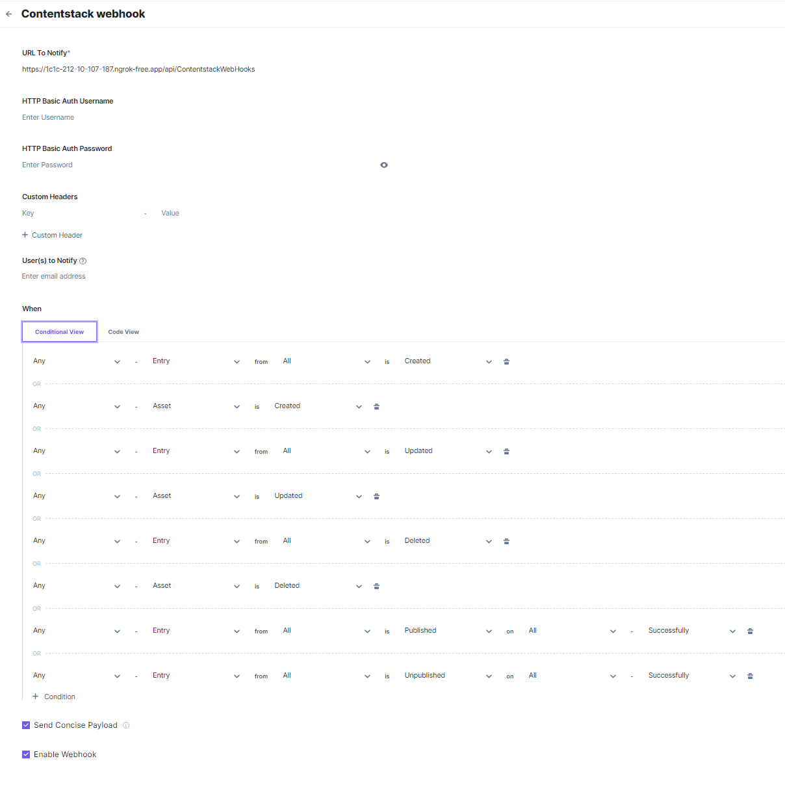

# [Enterspeed Contentstack Source](https://www.enterspeed.com/)

## Test locally

To test the function locally you must do the following:

1) Setup configuration
   1) Copy the `example_local.settings.json` file and rename the copy to `local.settings.json`
   2) Fil out the empty settings like API keys and urls for Enterspeed and Contentstack
2) Start the Azure function in Visual Studio or what ever editor you are using 
3) Expose the local url of the Azure function to the Internet
   1) Create a free account on https://ngrok.com/
   2) Download ngrok and setup ngrok https://ngrok.com/download
   3) Start a tunnel on the port where the Azure function is running
4) Setup a webhook in Contentstack
   1) Setup a webhook in Contentstack using the ngrok url 
   
5) Publish an entry or asset from Contentstack to push it to Enterspeed

## Seeding

To seed all entries and assets from a space in Contentstack do a POST request like shown here:

```http
   POST http://localhost:7009/api/v1
   X-Contentstack-Topic: ContentManagement.Seed
```